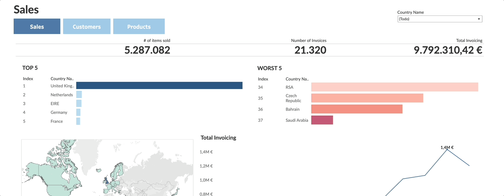

# e2eShop-pipeDash



<br></br>
<p align="center">
    <a href="https://public.tableau.com/app/profile/eduardo.almazan.galisteo/viz/e2e-shop-pipedash/Customers" target="_blank">
        
    </a>
</p>
<br></br>

## Overview
**e2eShop-pipeDash** is a complete end-to-end pipeline and dashboard project designed to provide insights into an commerce business. It gathers, processes, and visualizes key metrics such as sales and customer behavior, enabling data-driven decisions for optimization. This project demonstrates integration with AWS (for data ingestion and storage in S3), Airflow (for orchestration), Snowflake (as a data warehouse), and Tableau for final data visualization.

## Problem Statement
Many businesses need a streamlined, scalable way to monitor and analyze their data. This project aims to solve this problem by building a pipeline that captures essential metrics, organizes data for efficient querying, and presents the results in a dashboard for quick insights. This approach provides business leaders with a clear, actionable view of their performance, inventory, and customer behavior.

## Technologies
- **AWS Lambda**: Automates data ingestion from source files to S3 (serving as a datalake).
- **AWS Glue**: Automates data transformation with Spark.
- **AWS Athena**: Enables SQL checks of the processed S3 data.
- **AWS S3**: Datalake of the project.
- **Apache Airflow**: Orchestrates the full process.
- **Snowflake**: Data warehouse for structured storage and querying.
- **Tableau**: Dashboard for visualizing the final metrics and insights.

## Project Phases summary
1. **Data Analysis and Data Modelling**: Inspection, design and modelling of the complete databases and ETL flow.
2. **Data Ingestion**: Ingestion from sources to S3 datalake.
3. **Data Transformation**: Process and clean the raw data with Glue and Spark.
4. **Data Storage and Management**: Store the clean tables in the Snowflake data warehouse.
5. **Data Orchestration**: Controls the end to end ETL process.
6. **Data Visualization**: Visualize the data in Tableau.

## Folder Structure

```bash
e2eShop-pipeDash/
│
├── airflow/                             # Airflow instalation (add it to your local repo)
├── aws/                                 # Input data of the project
│   ├── glue_transform.py                # Spark files for Glue job
│   └── lambda_ingest.py                 # Lambda function for ingestions
│
├── dags/                                # Airflow DAGs for ETL process
│   ├── pipeline_dag.py                  # Main DAG defining the ingestion, transformation, and loading process
│   ├── test_glue_dag.py                 # DAG for glue test
│   ├── test_lambda_dag.py               # DAG for lambda test
│   ├── test_s3_dag.py                   # DAG for S3 connection test
│   └── test_snowflake.py                # DAG for Snowflake connection test
│
├── dashboards/                          # Tableau dashboard and images
│   └── e2e-shop-pipedash.twbx           # Tableau dashboard file
│
├── data/                                # Input data of the project
│   ├── main_product_description.csv     # Description of each of the items groups
│   └── retail.csv                       # Transactions raw file
│
├── glue_env/                            # Python environment for glue
├── notebooks/                           # Notebooks for prototyping and data exploration
│   └── prepare_data.ipynb               # Analyse the raw data and the necessary transformations
│
├── snowflake/                           # Input data of the project
│   ├── aws_import.sql                   # SQL for aws import in snowflake
│   └── calculate_etls.sql               # SQL for calculate the aggregated etls
│
├── img/                                 # Images and GIFs for README
├── README.md                            # Documentation and project overview
├── requirements.txt                     # Dependencies
├── environment.yml                      # Conda environment configuration (optional)
├── LICENSE             
├── aws_setup.py                         # AWS config (add it to your local repo)
├── openai_setup.py                      # openAI config (add it to your local repo)
└── .gitignore                           # Excludes unnecessary files from version control
```

## Workflow


### Data Analysis and Data Modelling
First, the sources are reviewed using a notebook to perform an initial analysis of the available data, generate synthesised data to improve the final result given the limitations of the databases, and perform an initial design in Python of the different stages of the process. Once reviewed, we proceed to the design of the data model, choosing a basic structure of dimension and fact tables.


#### Using the GPT API

The **GPT API** is integrated into improve the data available for better insights in the visualization phase.The API is used in the notebook prepare_data.ipynb to generate the extra file main_product_descriptions.csv

#### Setup Instructions
1. **API Key**: To enable the GPT functionality, you'll need an API key from OpenAI. If you haven’t done so already, sign up for an API key at [OpenAI's website](https://platform.openai.com/signup).
   
2. **Configuration File**: In the project’s root directory, create or locate the `openai_setup.py` file. Replace the placeholders with your OpenAI credentials as shown below:

```python
   conf = {
       'organization': 'your_organization_key_here',
       'project': 'your_project_key_here',
       'key': 'your_openai_api_key_here'
   }
```

**Important**: Ensure that openai_setup.py is included in your .gitignore file to keep your API key secure and prevent accidental exposure in public repositories.

### Data Ingestion
AWS Lambda ingests data from the eCommerce source (e.g., transactions, inventory data) and uploads it to an Amazon S3 bucket, serving as a datalake.

### Data Transformation
Once the data is in S3 a Glue job processes it within and save the transformed tables in S3. For testing, a Glue Crawler scans the S3 bucket to be able to check the data with AWS Athena.

### Data Storage and Management
Snowflake serves as the data warehouse, storing clean, transformed data. The tables are structured to support quick querying and analysis. Also, four aggregated etls has been calculated through SQL to improve data consumptions for analytical purpouses.


### Data Orchestration
Airflow orchestrates the complete ETL process. The Airflow DAG (`pipeline_dag.py`) controls the ingestion with lambda, transformation with Glue and the connections with the data warehouse in Snowflake. In the last step, calculates the additional etls.

For Airflow installetion, check: https://github.com/apache/airflow
> **‼️👀🚨 IMPORTANT 🚨👀‼️**: Be sure that you have install AWS and Snowflake dependencies.


### Data Visualization
Tableau connects to Snowflake to visualize the final dataset:
- **Sales**: Overview of the main sales metrics and status.
- **Customers**: Overview of customers metrics.
- **Products**: Detailed evolution of each of the product categories.

<br></br>
<p align="center">
    <a href="https://public.tableau.com/app/profile/eduardo.almazan.galisteo/viz/e2e-shop-pipedash/Customers" target="_blank">
        
    </a>
</p>
<br></br>


